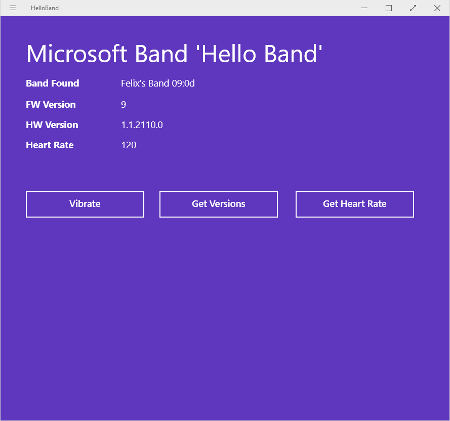

# Microsoft Band
This is a small sample application showcasing the interaction with a Microsoft Band from a WinRT-based app. It shows how to get Bands paired with the current system, how to iterate over them, and how to control them - including reading the various sensors and sending simple commands (like vibration). This sample requires the [Microsoft Bank Preview SDK](http://developer.microsoftband.com/).

All the code you care about [is probably in the MainPage.cs](https://github.com/felixrieseberg/MicrosoftBand-Sample/blob/master/HelloBandPhone/MainPage.xaml.cs).

